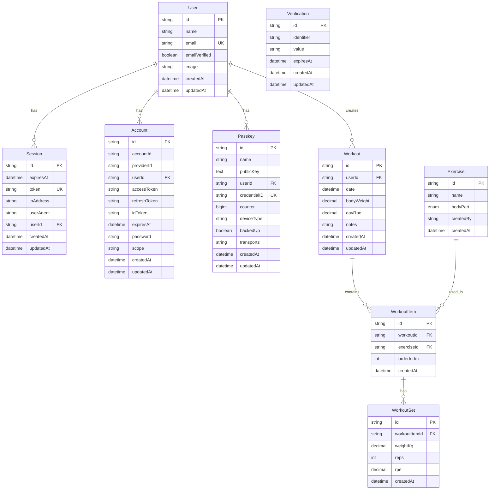

# データベース ER図

## Mermaid ER図

## リレーションシップ説明

### better-auth 関連
- **User 1:N Session**: 1ユーザーは複数のセッションを持つ
- **User 1:N Account**: 1ユーザーは複数のアカウント（OAuth等）を持つ
- **User 1:N Passkey**: 1ユーザーは複数のPasskeyを持つ
- **Verification**: 独立テーブル（ユーザーとのリレーションなし）

### アプリケーション関連
- **User 1:N Workout**: 1ユーザーは複数のワークアウトを持つ
- **Workout 1:N WorkoutItem**: 1ワークアウトは複数の種目を持つ
- **Exercise 1:N WorkoutItem**: 1種目は複数のワークアウトで使用される
- **WorkoutItem 1:N WorkoutSet**: 1種目は複数のセットを持つ

## 制約

### ユニーク制約
- `User.email`: メールアドレスは一意
- `Session.token`: セッショントークンは一意
- `Account.providerId + accountId`: プロバイダーとアカウントIDの組み合わせは一意
- `Verification.identifier + value`: 識別子と値の組み合わせは一意
- `Passkey.credentialID`: 認証情報IDは一意
- `Exercise.name + bodyPart`: 種目名と部位の組み合わせは一意
- `Workout.userId + date`: 1ユーザーは1日1件のワークアウト

### 外部キー制約
- `Workout.userId` → `User.id` (CASCADE DELETE)
- `WorkoutItem.workoutId` → `Workout.id` (CASCADE DELETE)
- `WorkoutItem.exerciseId` → `Exercise.id`
- `WorkoutSet.workoutItemId` → `WorkoutItem.id` (CASCADE DELETE)
- `Session.userId` → `User.id` (CASCADE DELETE)
- `Account.userId` → `User.id` (CASCADE DELETE)
- `Passkey.userId` → `User.id` (CASCADE DELETE)

### 注意事項
- `Exercise.createdBy` は `User.id` を参照しますが、外部キー制約は設定されていません（柔軟性のため）

